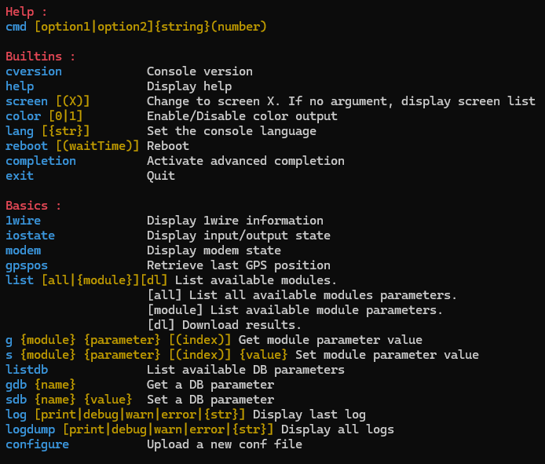

# Examining vehicle honeypot attack data under the scope of existing frameworks

## Oracle Cloud Setup:
The virtual machine that the honeypot in this project is run on is rented from the [Oracle Cloud Infrastructure](https://www.oracle.com/cloud/).
Once an account has been created, the user can rent up to two AMD Compute VMs for free. The steps for setting up these VMs are listed below:
1) Navigate to `Instances` and create an instance with the desired OS, memory size and processor.
2) This involves creating a subnet, VCN and VNIC. Additionally, creating a network security group with ingress and engress rules for the instance is advised here.
3) Log into the instance via SSH.
4) If more than one IP address for the honeypot is desired, this means that an additional VNIC has to be created and attached to the instance. This step is best explained by [this video](https://www.youtube.com/watch?v=amYLnXEDs9w&ab_channel=OracleLearning).
5) The script in question can be found in the [scripts folder](scripts/).

1) Oracle cloud VPS running on 130.61.249.221 (reachable via telnet only on 150.230.146.110)
2) Git connection set up
4) Fake telent socket on port 23 reachable from all IPs
5) Command logging based on IP
6) Different IPs:
        - `sudo su`
	- `./secondary_vnic_all_configure.sh -c`   
7) Able to handle multiple clients
8) Console view for help() function completed  
9) Start server on OCI launch.:
	`crontab -e` -> `@reboot /home/ubuntu/Masters/run_vehicle_server.sh`

## TODOs 
2) Imporve console commands
3) Split project into more filessuch as:
   - fake_console.py (design of what the console should look like)
   - request_handler.py (handles multiple requests, makes instances for each IP with memory maybe?)
   - server.py (sets up a proper telnet sever with a different IP than the VPS)
   - device_info.py (adds fake information in order to disguse the VPS) 
4) proper error handeling so the server cannot be crashed, no matter the input
5) proper kill switch on CTRL+C, force threads to join and terminate them
